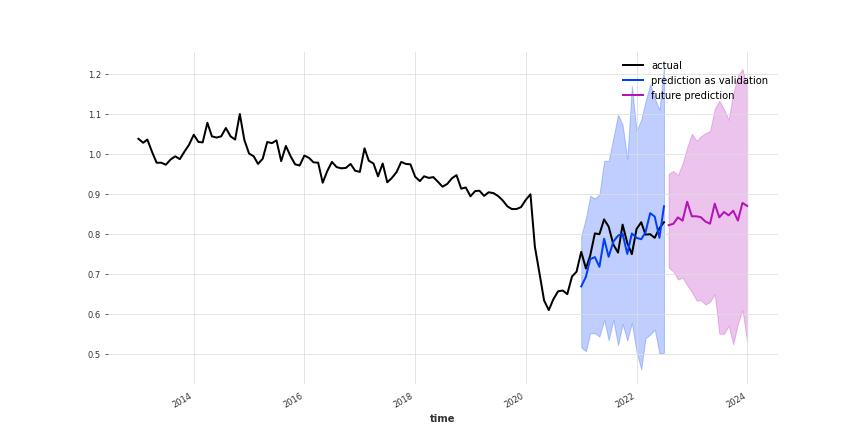
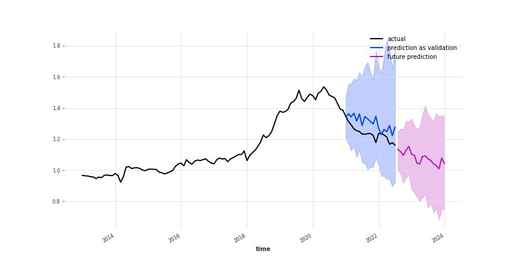

# 鉱工業指数予測
Neural Basis Expansion Analysis Time Series Forecasting (N-BEATS) を用いて鉱工業指数を予測します。  
darts(https://unit8co.github.io/darts/index.html) というライブラリを使用し実装しています。

## 仕様
データは https://www.meti.go.jp/statistics/tyo/iip/b2015_result-2.html からダウンロードしています。周期としては月次データを用い、時系列を学習データ(2020/12まで)と検証データ(2021/1から)に分割しています。予測は2022年8月から18か月後まで算出しています。

また、データはすべて100で割ってから学習に回しています。

### 予測精度
予測はdartsによる実装の標準パラメータに近い設定で行っており、最適化されておりません。そのため実際の値と予測に大きく乖離が出る可能性がございます。また、このレポジトリは実験段階のものであり、コードに不具合がある可能性もありますので実装をご確認の上ご使用ください。

## 出力
予測グラフはリリースページからダウンロード可能です。高品質版(300dpi)と低品質版(72dpi)に分けておりますので用途によって使い分けてください。

## サンプル
### 業種別__その他製品工業__出荷

### 業種別__化学工業（除．無機・有機化学工業）__在庫
